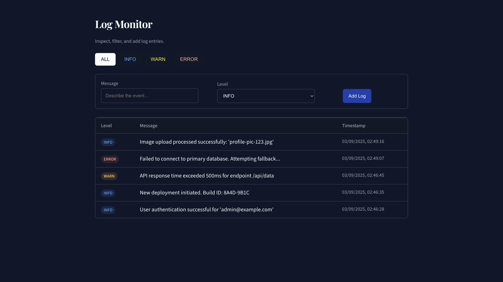

# Log Monitor - A Full-Stack MERN Application

A real-time event logging and monitoring dashboard built from the ground up with the MERN stack, featuring a professional, v0-inspired user interface.



## Features

* **Full CRUD Functionality:** Create and view log entries with different severity levels (INFO, WARN, ERROR).
* **Dynamic Filtering:** Instantly filter the log list by severity level with a responsive UI.
* **RESTful API:** A robust backend API built with Node.js and Express for handling all data operations.
* **Professional UI:** A clean, dark-mode interface inspired by v0.dev and styled with a custom, static CSS stylesheet to ensure maximum compatibility and performance.

## Tech Stack

* **Frontend:** React.js
* **Backend:** Node.js, Express.js
* **Database:** MongoDB (with Mongoose)
* **Styling:** Custom Static CSS (inspired by Tailwind CSS)

## Local Setup

1.  **Clone the repository:**
    ```bash
    git clone <your-repo-url>
    ```
2.  **Setup the Backend:**
    ```bash
    cd server
    npm install
    # Create a .env file with your MONGO_URI
    npm start
    ```
3.  **Setup the Frontend:**
    ```bash
    cd client
    npm install
    npm start
    ```
